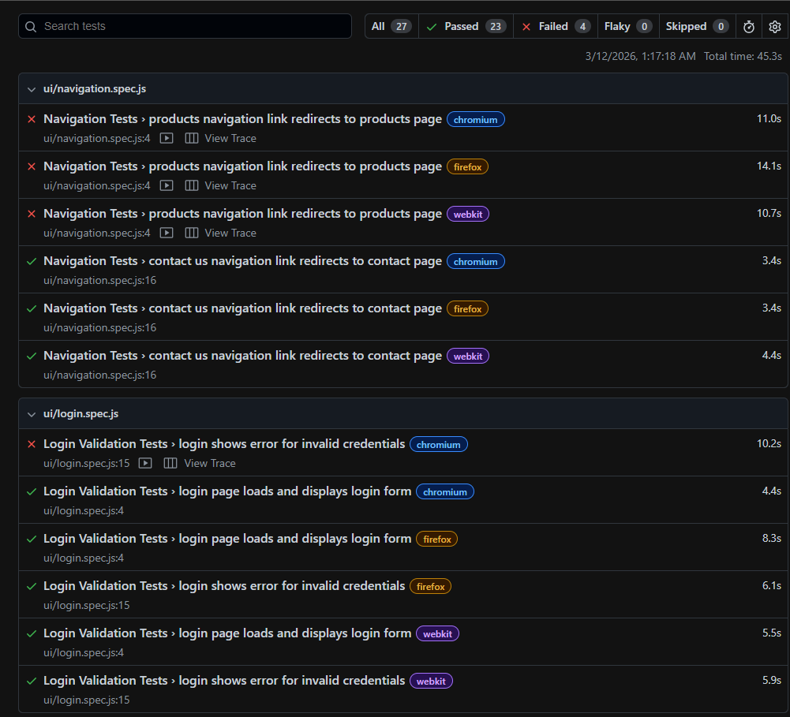
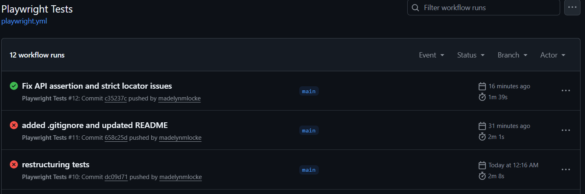
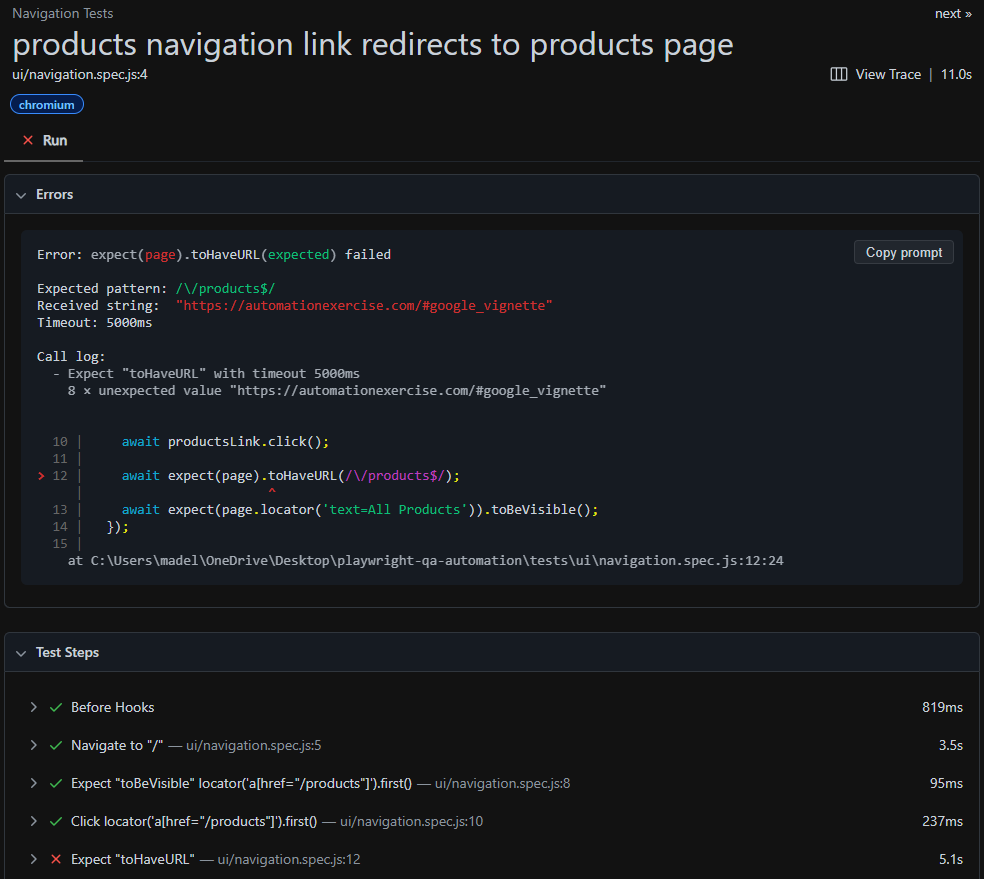

# QA Automation Testing Project

## Project Overview
This project demonstrates automated UI and API testing using Playwright and JavaScript. 
The goal is to validate core application functionality through automated test scenarios covering
 navigation, authentication, form validation, and API response handling.

The repository simulates a simplified QA automation workflow, combining automated test scripts,
 manual test case documentation, and defect reports to demonstrate common testing practices 
 used in real development environments.

## Technologies Used
- Playwright - UI and API test automation
- JavaScript - test scripting
- Node.js - runtime environment 

## Project Purpose
This project demonstrates key QA engineering concepts including: 
- Automated UI testing
- API response validation
- Test case design
- Defect documentation
- Positive and negative test scenarios

The repository includes:
- Automated Playwright test scripts
- Manual test case documentation
- Defect reports
- Test coverage tracking

## Project Structure
```md 
qa-automation-suite
│
├── .github
│   └── workflows
│      └── playwright.yml
│
├── e2e
│    ├── ui
│    │    ├── homepage.spec.js
│    │    ├── products.spec.js
│    │    ├── login.spec.js
│    │    └── contact-form.spec.js
│    │
│    ├── api
│    │     ├── account.api.spec.js
│    │     ├── auth.api.spec.js
│    │     ├── brands.api.spec.js
│    │     ├── products.api.spec.js
│    │     └── search.api.spec.js
│    │ 
│    └── workflows
│           ├── account-workflow.spec.js
│           └── products-workflow.spec.js
│
├── test-cases
│    ├── ui
│    │    ├── homepage-test-cases.spec.js
│    │    ├── products-test-cases.spec.js
│    │    ├── login-authentication-test-cases.spec.js
│    │    └── contact-form-test-cases.spec.js
│    │
│    └── api
│         └── api-response.spec.js
|
├── defects
│    ├── ui
│    │    └── view-product-bug.md
│    │
│    └── api
│        ├── POST-invalid-login-bug.md
│        ├── POST-search-bug.md
│        ├── DELETE-login-bug.md
│        ''(Rest of defects)''
│
└── README.md
```
### e2e/
Contains automated Playwright test scripts that validate UI behavior and API responses.

### test-cases/
Contains manual QA test cases describing expected application behavior and test steps.

### defects/
Contains example bug reports documenting reproducible issues discovered during testing.

### .github/workflows/playwright
This project includes a GitHub Actions workflow that automatically runs Playwright tests on every 
push and pull request to the `main` branch.

CI workflow location:
.github/workflows/playwright.yml

## Test Coverage
- Page load verification
- Login functionality
- Form validation
- Navigation links
- API response validation

| Test Type | Test Suite | Scenario | Description |
|-----------|------------|----------|-------------|
| UI | homepage.spec.js | Homepage Smoke Test | Verifies homepage loads correctly, header/footer render, and navigation links are visible |
| UI | login.spec.js | Login Validation | Verifies login page loads and displays an error when invalid credentials are submitted |
| UI | contact-form.spec.js | Contact Form Submission | Verifies contact form fields are visible and form can be submitted successfully |
| UI | products.spec.js | Products Validation | Verifies navigation links redirect to correct pages such as Products and Contact Us |
| API | products.api.spec.js | Products API Response | Verifies products API returns a valid response with product data |
| API | search.api.spec.js | Products API Response | Verifies search API returns a valid response with product data |
| API | brands.api.spec.js | Products API Response | Verifies brands API returns a valid response with brand data |
| API | auth.api.spec.js | Products API Response | Verifies login API returns a valid response with user data |
| API | account.api.spec.js | Products API Response | Verifies account API returns a valid response with user data |

## Test Scenarios
The automated tests validate a variety of application behaviors.

### UI Tests
Examples include:

- Homepage loads successfully and displays core interface elements
- Navigation links redirect users to the correct pages
- Login functionality authenticates valid users
- Form validation prevents submission of invalid input

### API Tests
Examples include:

- API endpoint returns HTTP 200 with valid JSON data
- Invalid endpoints return appropriate error responses (404)

## Running the Tests
```bash
npm install
npx playwright install
npx playwright test
```

## Test Execution Report
Playwright provides a built-in HTML dashboard for reviewing test results across browsers.



## Continuous Integration
Tests run automatically on every push using GitHub Actions.



## Debugging Failed Tests
Playwright captures traces, logs, and screenshots to help diagnose failures.



## Defect Documentation
The repository includes sample defect reports demonstrating how issues are documented in a QA workflow.

Bug reports may include:

- Summary
- Environment
- Steps to reproduce
- Expected result
- Actual result
- Severity
- Root Cause
- Suggested Fix
- Status

This mirrors real bug tracking systems such as:

- Jira
- Azure DevOps
- Bugzilla

## Future Improvements
Potential enhancements for this project include:

- Adding cross-browser testing
- Implementing CI test execution using GitHub Actions
- Expanding API test coverage
- Adding performance or load testing scenarios
- Create reusable functions, helpers, and fixtures
- Remove duplicate logic and make scalable

## Learning Goals
This project was created to practice and demonstrate:

- Automated testing frameworks
- QA documentation standards
- Debugging and defect reproduction
- Structured test design